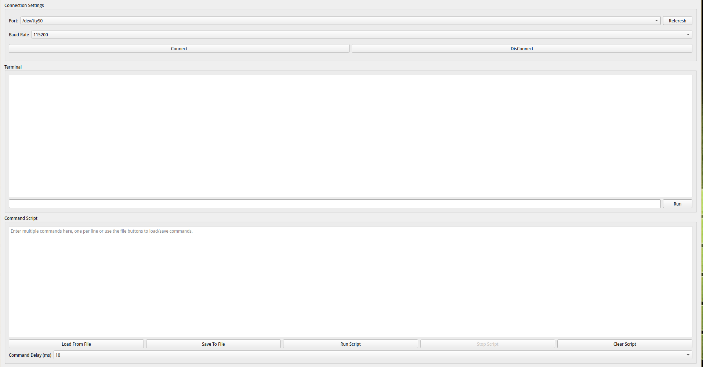

# Qt Serial Console Application

A cross-platform serial communication terminal built with PyQt for interacting with embedded devices (Arduino, ESP32, STM32, etc.). Provides real-time data transmission and monitoring with a user-friendly interface.

 <!-- Add your screenshot path here -->

## Features

- **Cross-platform Support** (Windows, Linux, macOS)
- **Intuitive GUI** with connection management
- **Multiple Baud Rates** (9600 - 115200)
- **Port Autodetection** for connected devices
- **Real-time Monitoring** with timestamping
- **Data Transmission** in ASCII/UTF-8
- **Line Ending Options** (None, CR, LF, CR+LF)
- **Send History** with command recall
- **Text Logging** with save/clear functionality

